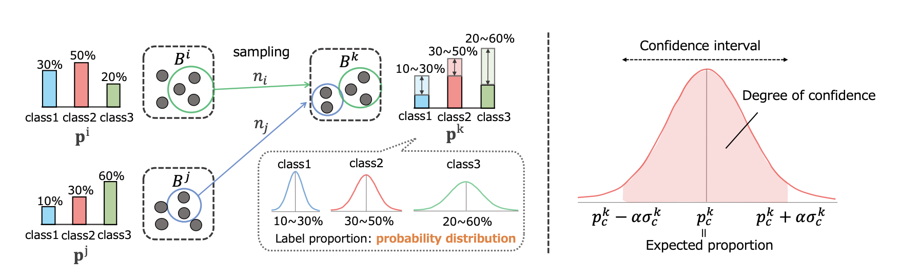

# [Mixbag: Bag-Level Data Augmentation for Learning from Label Proportions](https://openaccess.thecvf.com/content/ICCV2023/papers/Asanomi_MixBag_Bag-Level_Data_Augmentation_for_Learning_from_Label_Proportions_ICCV_2023_paper.pdf)

## Overview of our method

Takanori Asanomi, Shinnosuke Matsuo, Daiki Suehiro, Ryoma Bise
> Learning from label proportions (LLP) is a promising weakly supervised learning problem. In LLP, a set of instances (bag) has label proportions, but no instance-level labels are given. LLP aims to train an instance-level classifier by using the label proportions of the bag. In this paper, we propose a bag-level data augmentation method for LLP called MixBag, based on the key observation from our preliminary experiments; that the instance-level classification accuracy improves as the number of labeled bags increases even though the total number of instances is fixed. We also propose a confidence interval loss designed based on statistical theory to use the augmented bags effectively.


## Requirements
* python >= 3.9
* cuda && cudnn

We strongly recommend using a virtual environment like Anaconda or Docker.
The following is how to build the virtual environment for this code using anaconda.
```
# pytorch install
$ pip install torch==1.9.1+cu111 torchvision==0.10.1+cu111 torchaudio==0.9.1 -f https://download.pytorch.org/whl/torch_stable.html
$ pip install -r requirements.py
```

## Dataset
```
./dataset
    ├── train
    │   └── train_imgs                       
    │        ├── sequence001                # Each sequence has 300 images 
    │        ├── sequence002
    │        ├── :
    │        └── sequenceN                       
    ├── val  
    │   └─ val_imgs                          # Same structure of train_imgs
    │        ├── sequence011                # Each sequence has 12 images 
    │        ├── sequence015
    │        ├── :
    │        └── sequenceM  
    └── test
         └── test_imgs                       # Same structure of train_imgs.
              ├── sequence011                # Each sequence has 300 images 
              ├── sequence015
              ├── :
              └── sequenceM  
```

## Training & Test
If you want to train network, please run following command.
5 fold cross-validation is implemented and Test is automatically done in our code.
```
$ python run.py
```

## Citation
If you find MixBag useful in your work, please cite our paper:
```none
@inproceedings{asanomi2023mixbag,
  title={MixBag: Bag-Level Data Augmentation for Learning from Label Proportions},
  author={Asanomi, Takanori and Matsuo, Shinnosuke and Suehiro, Daiki and Bise, Ryoma},
  booktitle={Proceedings of the IEEE/CVF International Conference on Computer Vision},
  pages={16570--16579},
  year={2023}
}
```

## Author
👤 **Takanori Asanomi**
* Github: [@takanoriasanomi](https://github.com/asanomitakanori)
* Contact: asataka1998@gmail.com